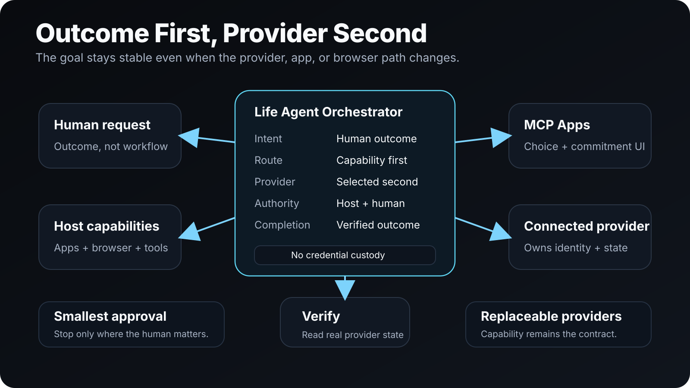

# Life Agent

**State the outcome. Life Agent coordinates the steps and stops at the smallest human decision that matters.**

Life Agent is an outcome-first orchestration plugin for personal administration across connected apps, browser flows, calendars, messages, travel, and provider accounts. It resolves the capability a request needs before selecting a provider, performs only authorized work, verifies consequential mutations, and keeps authentication material outside persistent agent state.

[Hackathon submission](HACKATHON_SUBMISSION.md) · [Demo runbook](DEMO_RUNBOOK.md) · [Architecture](docs/ARCHITECTURE.svg) · [Source](https://github.com/tjXJNOOBIE/Life-Agent)



## Why Life Agent

Most personal assistants are built around apps or integrations: pick a service, expose a tool, then make the user translate their goal into that provider's workflow. Life Agent starts from the outcome instead.

A request such as “book the trip and keep my calendar straight” can cross discovery, comparison, authentication, payment, scheduling, confirmation, and follow-up. Life Agent keeps that work coordinated while preserving a hard line between **reasoning**, **authorization**, and **provider-owned identity**.

It is deliberately not an account system, payment vault, inbox, calendar, CRM, browser-profile store, or credential proxy. Connected providers own their data and authentication. The host owns app connections, browser/computer use, approvals, and native UI.

## What it does

Life Agent exposes seven production MCP App surfaces:

| Surface | Purpose |
| --- | --- |
| **Choice** | Present compact, comparable options. |
| **Commitment Surface** | Show the selected item, consequences, conflicts, micro-decisions, and the smallest remaining approval boundary. |
| **Handoff** | Narrow user-assisted authentication, payment, MFA, or provider steps. |
| **Live Execution** | Show verified step state and required handoffs. |
| **Outcome** | Return a compact verified receipt plus justified follow-ups. |
| **Settings** | Manage preferences, standing permissions, and safe identity metadata. |
| **Capability Route** | Show capability-first, provider-second routing evidence. |

The UI uses the checked-in dark contextual glass system in [`fixtures/life-agent-glass-ui-system.html`](fixtures/life-agent-glass-ui-system.html), with compact layouts, restrained glass, recognizable provider marks, progressive disclosure, and one obvious primary action.

## Capability first, provider second

Life Agent separates *what must happen* from *which provider happens to do it*.

```text
human outcome
  -> resolve required capability
  -> choose an available provider
  -> present options / commitment
  -> obtain the smallest necessary approval
  -> execute through host/provider boundary
  -> verify the real provider state
  -> return outcome + follow-up commitments
```

That keeps provider selection replaceable and prevents the orchestration layer from quietly becoming a second account or identity system.

## Bounded by design

Life Agent treats authentication and authorization as different problems.

- Persistent identity links contain safe provider identity metadata, never reusable authentication material.
- Passwords, tokens, cookies, MFA/recovery material, payment credentials, and browser profiles are never stored in `LIFE.md`.
- Browser fallback is task-scoped and receives an isolated temporary runtime plus a task-bound `AuthLease`.
- Identity linking, OAuth scope changes, passwords, MFA, recovery, security settings, material financial/legal changes, changed targets, changed routes, changed prices, or changed terms return to the user.
- Consequential mutations verify provider state before retrying an ambiguous failure.
- MCP widgets do not fetch arbitrary network resources, use browser storage/cookies, submit forms, or render arbitrary URLs.
- Shared UI assets come from an endpoint-owned, content-addressed cache that is separate from user/plugin state.

See [`docs/BROWSER_AUTH.md`](docs/BROWSER_AUTH.md) and [`docs/UI_ASSET_CACHE.md`](docs/UI_ASSET_CACHE.md) for the deeper boundaries.

## Install

### Requirements

- Node.js
- Git
- ChatGPT Desktop or another compatible MCP/plugin host for local plugin testing

Clone and validate the repository:

```bash
git clone https://github.com/tjXJNOOBIE/Life-Agent.git
cd Life-Agent
npm test
```

The marketplace lives at `.agents/plugins/marketplace.json` and the plugin is under `plugins/life-agent/`.

For Codex CLI development installs:

```bash
codex plugin marketplace add tjXJNOOBIE/Life-Agent --ref main
```

## Hosted MCP adapter

The same MCP server used by stdio can run behind the dependency-free HTTP adapter:

```bash
LIFE_AGENT_ASSET_CACHE_DIR=/var/lib/life-agent/assets \
LIFE_AGENT_HTTP_AUTH_TOKEN='generate-a-secret-at-least-16-characters' \
LIFE_AGENT_PORT=3000 npm run serve:http
```

The adapter exposes:

- `GET /healthz`
- `POST /mcp`
- read-only `GET|HEAD /assets/<64-lowercase-hex-sha256>`

Loopback development may omit the token. A non-loopback bind fails closed unless bearer authentication is configured. The adapter does not add provider credentials, arbitrary URL fetching, payment authority, or provider mutation authority.

## MCP and UI contract

The stdio server supports the legacy MCP `2025-11-25` and current MCP `2026-07-28` protocol eras. Current clients can use `server/discover`; resources carry explicit discriminator/cache metadata and tool calls are uncached.

Tool output is sanitized before it reaches a widget. Credential/session-shaped fields and prototype-pollution keys are rejected, while depth, node count, array length, string length, and aggregate output size are bounded.

The UI surfaces use the MCP Apps view contract and render only server-provided tool output plus the standard app lifecycle messages.

## Validate the release

Run the complete dependency-free suite:

```bash
npm test
```

Coverage includes protocol compatibility, all seven UI surfaces, sanitizer limits, approval/retry safety, asset URL/IP/MIME/size safety, cache behavior, endpoint/user-state separation, hosted asset routing, and manifest-compatible behavior.

Live third-party authentication ceremonies and real provider-side consequences remain explicit host/provider acceptance boundaries. The repository does not pretend a deterministic test suite booked somebody a flight. Humanity has suffered enough from demos doing improv.

## Hackathon evidence

- [`HACKATHON_SUBMISSION.md`](HACKATHON_SUBMISSION.md) contains the submission framing and pre-existing-component disclosure.
- [`DEMO_RUNBOOK.md`](DEMO_RUNBOOK.md) contains the controlled demo and acceptance path.
- [`docs/ARCHITECTURE.svg`](docs/ARCHITECTURE.svg) captures the product boundary visually.
- [`docs/UI_SURFACES.md`](docs/UI_SURFACES.md) documents the seven user-facing surfaces.

The project is released under the [MIT License](LICENSE).
